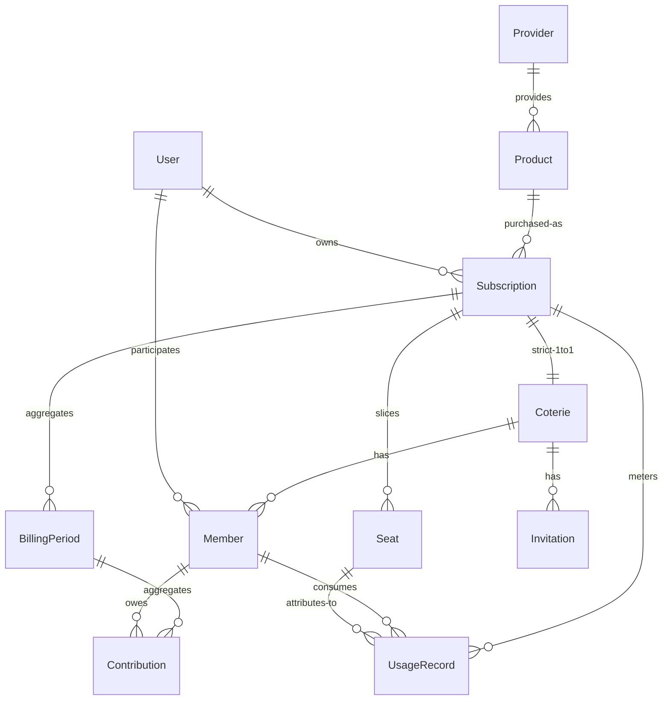

# Coterie 设计计划

| | |
|---|---|
| 状态 | 草稿（Draft） |
| 文档版本 | v0.1 |
| 相关文档 | [总体计划](./project-plan.md) · [需求文档](./requirements.md) |

本文是重构与实现的依据：领域模型、共享模型、计费/支付、技术架构、模块划分、API 与部署。

---

## 1. 领域模型

总览（精确基数见 [§1.2](#12-实体关系er)）：

```text
Provider
    │
    ▼
Product
    │
    ▼
Subscription ── Seats（容量切分）
    │                ▲
    │ 严格 1:1        │ 分配：谁坐哪个坑
    ▼                │
  Coterie ── Member ─┘
      │
      ├── Invitation
      └── BillingPeriod ── Contribution
```

模型与设计原则的对应关系：

| 概念 | 对应原则 |
|------|----------|
| Provider / Product / Subscription 分离 | Principle 1（Generic First）、Principle 2（Subscription ≠ Account） |
| Coterie 为核心 | Principle 4 |
| Member 是平台用户，不是第三方账号 | Principle 3（Member ≠ Account） |
| Subscription 不含密码 | Principle 8（Secret Is Optional） |

### 1.1 概念定义

每个概念用「是什么 / 不是什么」双向定义，划清身份边界。字段级需求见 [需求文档 FR-1 ～ FR-9](./requirements.md#4-功能需求)，本节只回答「这个概念是什么、边界在哪里」。

| 概念 | 是什么 | 不是什么 | 关键字段 |
|------|--------|----------|----------|
| **User** | 平台身份：登录与全局唯一的人 | 不是第三方账号，不保存任何 Provider 凭证 | id, username, email, locale, timezone, status |
| **Provider** | 数字服务提供商的**目录条目**（metadata），描述「谁提供服务」 | 不是订阅，不含套餐与价格 | id, name, category |
| **Product** | Provider 的**可购买套餐**（plan/SKU），描述「买什么」 | 不是已购买的实例；实际支付价格属于 Subscription | provider_id, name, tier |
| **Subscription** | 一次**实际购买**的订阅实例，是**成本与容量的唯一源头**：唯一 Owner、计费周期、实际价格、Sharing Policy、Seat 容量 | 不是账号（不含凭证），不是共享圈（社交结构与之分离） | product_id, owner_user_id, billing_cycle, price, currency, renewal_date, status, max_seats |
| **Coterie** | 围绕**恰好一个 Subscription** 组织的**共享圈**（协作结构）：成员、角色、邀请、分摊都在圈内发生 | 不持有容量（容量来自订阅），不持有凭证 | subscription_id（全局唯一）, name, status |
| **Member** | User 在某个 Coterie 中的**参与记录**（角色 + 状态 + 加入/离开时间） | 不是 Seat（席位是资源，成员是人），不是第三方账号 | coterie_id, user_id, role, status, joined_at, left_at |
| **Seat** | Subscription 容量的**切分单元**，同时是**通用分配单元**（Quota 模式复用，见 D4） | 不是成员（可空闲），不是账号凭证 | subscription_id, label, status, metadata |
| **BillingPeriod** | Subscription 的一个**计费区间**，Contribution 的归集单位 | — | subscription_id, start_date, end_date, status |
| **Contribution** | 成员在某个计费周期内的**费用分摊记录** | 不是支付流水（支付是 Adapter，见 [§4.2](#42-payment-架构)） | billing_period_id, member_id, amount, currency, status |
| **UsageRecord** | 一条**用量记录**（追加式账本）：订阅内某成员的一次计量消费，可归集到其占用的一个席位 | 不是支付流水，不是配额本身（配额是 Seat metadata，见 D4）；记录只增不改，修正记负数 | subscription_id, member_id, seat_id, amount, unit, recorded_at |
| **SharingPolicy** | 挂在 Subscription 上的**共享规则**（模式 + 限制），数据驱动而非代码分支 | 不是业务逻辑里的 if-provider | mode, limits（JSONB） |
| **Invitation** | 进入 Coterie 的**凭证**（token、过期时间、角色） | 不是成员记录，接受后才创建 Member | coterie_id, token, role, expire_at |

身份边界三原则（对应设计原则 #2 / #3 / #8）：

- **Subscription ≠ Account**：订阅之下才有 Seats / Quota / Access，凭证永不入核心模型；
- **Member ≠ Account**：Member 是平台身份在圈内的投影，与任何第三方账号无关；
- **Seat ≠ 账号**：Seat 是分配单元，可以空闲、转移、回收。

### 1.2 实体关系（ER）



基数一览（**加粗为关键决策**）：

| 关系 | 基数 | 说明 |
|------|------|------|
| Provider → Product | 1 : N | 一个提供商多个套餐 |
| Product → Subscription | 1 : N | 同一套餐可被多次购买 |
| User → Subscription | 1 : N | 作为 Owner |
| **Subscription → Coterie** | **1 : 1（严格）** | `coteries.subscription_id` 全局 UNIQUE（D1） |
| **Subscription → Seat** | **1 : N** | 容量切分，席位归订阅所有（D2） |
| Subscription → BillingPeriod | 1 : N | 按周期归集费用 |
| Coterie → Member | 1 : N | 参与记录 |
| User → Coterie | N : M | 经由 Member |
| **Member → Seat** | **0..1 : 0..N** | 一名成员可占多席；任一时刻每个 Seat 至多一名占用者，可空闲。MVP 用 `seats.member_id` 可空外键表达，历史靠 Audit Log |
| BillingPeriod → Contribution | 1 : N | |
| Member → Contribution | 1 : N | |
| Subscription → UsageRecord | 1 : N | 用量账本（Phase 2 Usage Tracking），成员归因、可选席位归集（D9） |

### 1.3 聚合边界与所有权

两个聚合根 + 一组目录实体：

```text
Catalog（目录，弱事务）
└── Provider ── Product

Subscription 聚合根（容量与费用的源头）
├── Seat[]
├── SharingPolicy
├── UsageRecord[]
└── BillingPeriod[]

Coterie 聚合根（协作结构）
├── Member[]
├── Invitation[]
├── Contribution[]（引用 billing_period_id）
└── 引用 Subscription（仅 ID）
```

规则：

- **事务边界即聚合边界**：改 Seat / SharingPolicy / BillingPeriod = Subscription 聚合事务；改 Member / Invitation / Contribution = Coterie 聚合事务；
- **跨聚合只存 ID**：`coteries.subscription_id`、`contributions.billing_period_id`，不持久化对方对象；
- **跨聚合联动走领域事件**：如 `billing_period.closed` → 通知、`member.joined` → 重算 full 标志，对应 `pkg/events`。

### 1.4 关键不变量

1. **严格 1:1**：`coteries.subscription_id` 全局唯一，一个订阅整个生命周期至多一个圈（D1）；
2. **Owner 同一性**：Coterie 创建者必须是 Subscription.owner（D5）；MVP 不允许分离，转让留 Phase 2（转让时订阅与圈一起易主）；
3. **容量**：活跃 Seat 数 ≤ `subscription.max_seats`；Coterie **不单独存 capacity**，创建 API 的 `capacity` 参数语义是「为该订阅创建 N 个 Seat」（D1 + D2 的推论）；
4. **分配合法**：Seat 的占用者必须是「同一订阅所属圈」的活跃 Member；
5. **币种一致**：`contributions.currency` 必须等于 `subscriptions.currency`（MVP 单币种、无换汇，D6）;
6. **周期闭合**：Contribution 必须挂在存在且属于同一 Subscription 的 BillingPeriod 上。

### 1.5 Coterie 生命周期与状态机

持久化状态 5 个，`Full` 为派生标志（D3）：

```text
Draft ──▶ Open ──▶ Active ⇄ Paused
   │        │        │
   └────────┴────────┴────▶ Closed（终态）
```

| 状态 | 语义 | 进入条件 |
|------|------|----------|
| **Draft** | 创建未发布 | 创建 Coterie（必须已绑定 Subscription） |
| **Open** | 招募中，可邀请/加入 | Owner 发布 |
| **Active** | 正式运行，计费生效 | Owner 启动（订阅生效 / 首期开始） |
| **Paused** | 暂停：保留成员与席位，暂停结算 | Owner 暂停；可恢复到 Active |
| **Closed** | 结束共享 | Owner 关闭 / 订阅终止；终态 |

派生标志：`full = (空闲 Seat 数 == 0)`。

- 在 **Open** 状态下 full 为真时拒绝新成员加入；
- 在所有状态下作为展示信息（如「4/5 已满」）；
- 席位释放后自动解除，**不涉及状态迁移**。

行为语义（谁能做什么）见 [需求文档 FR-5](./requirements.md#fr-5-coterie)。

### 1.6 Seat：通用分配单元

Seat 统一承载两类分配，`sharing.mode` 决定其语义：

| 模式 | Seat 语义 | metadata 示例 |
|------|-----------|---------------|
| Seat / Family / Account | 一个可用的独立位置 | `{"label": "Slot 1"}` |
| Quota（D4） | 一份额度 | `{"quota": 300, "unit": "credits", "used": 0}` |
| Resource（D23） | 一份资源池占用 | `{"resource": 1024, "unit": "GB", "used": 0}` |

- 状态机：`free / occupied / disabled`；
- 分配：Seat ↔ Member（0..1 占用者），支持空闲、转移、回收（FR-8）；
- Quota 调整 = 更新 metadata，不新增实体；
- 使用量（`used`）的写入由 **Usage Record** 驱动（Phase 2 Usage Tracking）：账本记录落到席位归集后，`used` 重算为该席位归集记录的 SUM（投影，见 D9）；配额本身不被账本行修改。

### 1.7 各实体设计要点

字段清单见需求文档对应条目，此处只记录实现要点：

- **Provider / Product（目录）**：Product 不存价格，实际支付价在 Subscription；目录既可由用户经 Generic Provider 自建（[§5.3](#53-generic-provider)），也可来自 Provider Registry（[§5.4](#54-provider-registry未来)）。
- **Subscription**：聚合根，拥有 Seats / SharingPolicy / BillingPeriods；其 `status` 独立于 Coterie.status——订阅过期而圈尚存时，通过通知驱动圈的 Closed 流程，而不是级联硬删。
- **Coterie**：不存 capacity（不变量 3）、不存任何凭证（NFR-1）；成员与角色语义见 FR-7。
- **Member**：`UNIQUE(coterie_id, user_id)` 保证同一用户在同一圈最多一条活跃记录；离开用 `left_at` 软记录，历史保留供结算追溯。
- **Contribution**：由 Billing 任务按周期批量生成；Manual Settlement 下结算状态由 Owner 手动标记（见 [§4.2](#42-payment-架构)）。

### 1.8 设计决策记录（ADR）

| # | 决策 | 结论 | 理由与影响 |
|---|------|------|------------|
| **D1** | Subscription ↔ Coterie 基数 | **严格 1:1**（UNIQUE 外键） | 席位、费用、结算在单圈内闭环，模型最简；未来需要 1:N 时经迁移扩展 |
| **D2** | Seat 归属 | **Subscription** | 订阅是容量唯一源头——「订阅定坑位，圈内定人选」；Coterie 不存容量字段 |
| **D3** | Full 状态 | **派生标志** | 消除原文状态机中 Full 先于 Active 的歧义；持久化状态收敛为 5 个 |
| **D4** | Quota 建模 | **复用 Seat + metadata** | Seat 成为通用分配单元，概念数量最少；配额调整即 metadata 更新 |
| **D5** | Owner 同一性 | 圈 Owner ≡ 订阅 Owner（MVP） | 1:1 下费用责任人与圈管理人天然一致；转让是 Phase 2 特性 |
| **D6** | 币种 | MVP 单币种、无换汇 | Contribution 币种恒等于订阅币种；FX 留待真实支付阶段（Phase 2+） |
| **D7** | 数据访问层 | **GORM 做 CRUD；AutoMigrate 禁用** | schema 唯一来源仍是手写迁移（`migrations/`），DB 级不变量靠迁移约束保证（[§1.4](#14-关键不变量)）；GORM 只做查询/写入映射，schema 演进由 golang-migrate 在启动时执行 |
| **D8** | 平台认证 | **Email + 密码（bcrypt）+ 不透明 Bearer 会话令牌** | 密码仅存 bcrypt 哈希（可空，为 OAuth/Passkey 留位）；会话令牌 32B 随机数、DB 只存 SHA-256 哈希，泄露数据库也无法冒用（[§6.1](#61-安全模型)）；OAuth / Passkey / OIDC 作为认证模块的扩展点接入，不写死在核心 |
| **D10** | 圈曝光与加入请求 | **opt-in listing + JoinRequest** | 圈默认 `listing=private`，Owner 显式 `public` 才进入目录（FR-16 约束：圈不默认成为交易市场）；JoinRequest 单一活跃（每圈每用户至多一条 pending），Owner/Admin 决定，接受走与邀请一致的准入检查；Marketplace 本体是**只读目录 + 请求收件箱**，经导出的准入方法与核心解耦（[§12.3](#123-marketplace)） |
| **D9** | Usage 记账 | **追加式账本 + 投影** | `usage_records` 只增不改（修正记负数记录），是用量唯一事实源；quota Seat 的 `metadata.used` 是其席位归集记录的 SUM 投影，写入时行锁重算，不做增量累加（无浮点漂移、可对账）；账期 `usage` 分摊按成员期内用量比例、最大余数法分币，总额精确守恒（[§4.1](#41-billing)） |
| **D11** | Payment Adapter | **接口 + Manual 内置 + 只增账本** | `Adapter` 接口（`Charge→Receipt`）是唯一渠道接缝；`payments` 只增不改，金额/币种恒取自 Contribution（不变量 5），落账与 Contribution 置 `paid` 同事务；Owner 或付款成员可登记；真实渠道（Stripe 等）以新适配器接入，不改核心（[§4.2](#42-payment-架构)） |
| **D12** | Provider 插件面 | **按 slug 绑定 + 可选能力接口** | `Plugin` + 可选 `PolicyValidator`（订阅策略复验）/ `AdmissionGuard`（准入拒绝）/ `UsageValidator`（用量记账复验）；Registry 为空时全 Generic 语义，核心零依赖特定 Provider（[§5.1](#51-原则)）；核心准入同时执行 `max_members`（MemberLimit） |
| **D13** | 账务自动化 | **调度器滚期 + Owner 身份代办** | `auto_billing`（订阅级开关，默认关）开启后，进程内调度器（`AUTO_BILLING_INTERVAL`，默认 1h，0 关闭）在**前沿账期**（start_date 最大者）结束后以 **Owner 身份**走同一 billing 服务开下一期并按 `equal` 生成分摊——唯一约束/守恒/通知等全部不变量原样生效；monthly/yearly 可推算下期区间，`custom` 按周期天数 `cycle_days` 推算（D20）；首期恒手动（价格与起日是 Owner 决策）；滚期成功后 `subscription_renewal` 通知 Owner 及上期未结笔数（[§4.1](#41-billing)） |
| **D14** | 争议处理 | **独立账本 + 建议性裁决** | `disputes` 表（reason/evidence/status + decided_shape CHECK，每 Contribution 至多一个 open，部分唯一索引）；成员或 Owner 发起（cancelled 分摊不可争议），Owner 一向裁决（resolved/rejected，`decide` 单向原子）；**裁决不改分摊**——需要调整结算时 Owner 经既有 PATCH 显式操作，争议账本与资金流动解耦；通知 `dispute_opened`/`dispute_decided` 随迁移扩展类型清单（[§4.3](#43-dispute)） |
| **D15** | 账号信誉 | **纯派生 + 只读投影** | 信誉是 contributions 账本的投影，不是可写模型：按用户聚合其分摊记录状态计数（paid/pending/waived/cancelled）与各币种已缴/未缴金额，`payment_ratio` = paid ÷（paid+pending）（仅计「曾应收」的分摊，waived/cancelled 不入分母；无应收历史 → null 而非虚假 100%）。无手工评分、无写入面——没有可刷分的对象；`GET /api/v1/users/{id}/reputation`（已认证基线）（[§4.4](#44-reputation)） |
| **D16** | 真实插件样例 | **绑定种子目录 slug 的 `claude` 插件** | §5.2 插件位契约的首个真实实现，落 `providers/claude/`（policy/admission/usage 三面全实现）：策略要求 `region ∈ {us,eu}`（数据驻留）+ 可选 `plan ∈ {pro,max}`（缺省 max）；准入上 pro 为个人套餐拒绝一切加入、max 圈至多 5 人；记账仅收 `tokens`/`requests` 且单笔设上限（负数修正放行）。**绑定种子目录条目而非新建 Provider 行**——插件面向「已存在的 slug」增强语义，目录（§5.4）与插件（行为）解耦；经 `PROVIDER_PLUGINS=claude` 注册（与 `PAYMENT_METHODS` 同模式，未知名警告跳过），不注册则该 Provider 保持 Generic（[§5.2](#52-目录结构)） |
| **D17** | 审计日志 | **append-only 账本 + 同事务埋点 + Owner 只读** | FR-15 要求资金与成员变更必审计：`audit_logs` 只增不改（who/what/when/where/before/after），在既有业务事务内追加——审计失败即回滚业务写入，与「落账同事务」同一纪律（D11）；动作清单经 CHECK 枚举随迁移扩展；读取面只有订阅 Owner（订阅树按 `subscription_id` 枢纽查、圈按 `coterie_id` 枢纽查），成员不开放审计读（结果在其自有视图可见），Admin 面后续（[§6.3](#63-audit-log)）；埋点需要可信 actor，同批把订阅资源面的 Owner 强制补齐——**owner 即认证用户**（`owner_user_id` 载荷只能确认不能指名，创建/读取/列表/修改/删除全表面校验，抹平 M1 遗留的越权缺口） |
| **D18** | Marketplace 信誉展示位 | **纯派生徽标** | 目录条目附 Owner 结算信誉徽标（`owner`: user_id / username / 分摊计数 / `payment_ratio`），聚合复用 D15 同一派生（批量 SQL 与单用户报告同构），不另立评分路径；徽标是粗粒度公开投影——不含各币种金额（金额留在已认证报告端点），Owner 把圈发布为公开（`listing=public`）即接受展示位；无应收历史 ratio=null 不给虚假满分（[§4.4](#44-reputation)） |
| **D19** | Rate Limit | **内存固定窗口** | Phase 1 只挡现实滥用面——未认证公开写端点按 (端点, 客户端 IP) 计数：register 5 次/分、login 10 次/分，超限 429 JSON 信封 + `Retry-After`；单实例内存、无 Redis（§7.4），配置 0 即关闭；公开读与已认证端点等真实流量画像再议（[§6.4](#64-rate-limit)） |
| **D20** | 自定义计费周期 | **cycle_days 天数偏移** | 计费期的语义是「区间长度」（显式 `[start,end]`、同 start 唯一），cron 回答的是触发时刻且引入时区/表达式校验负担，故取**天数偏移**：`cycle_days`（1–365 整数）在 `billing_cycle='custom'` 时必填、非 custom 时必须为空，由行级 CHECK 双向强制；调度器（D13）按 `[end+1, end+cycle_days-1]` 推算下期，与 monthly/yearly 同一管线；变更入 `subscription_updated` 审计快照 |
| **D21** | Sharing Policy UsageLimit | **核心侧每成员每账期用量上限** | `sharing_policy.usage_limit = {"unit","per_period"}`（JSONB 承载，§3 无强结构列原则）；`POST /usage-records` 事务内插入前强制：对 `unit` 匹配的账本行、按 `recorded_at` 所在账期（`[start,end]`）对成员求和，**写入后新总和** > `per_period` → 409——判据是总和而非增量，负修正自然放行；无覆盖账期或 unit 不匹配不设限（账本先行，结算视角才需要账期）；比较按 1e4 定标整数，杜绝浮点；core 结构校验 unit（1–32 字符）与 per_period（正十进制 ≤4 位小数），插件可在同事务内叠加更严校验（D12） |
| **D22** | Push 通知 | **Web Push（RFC 8291 + RFC 8292 VAPID）** | Push 渠道取 Web Push 标准而非 FCM/APNs 私有通道（自托管友好、无厂商凭据）：用户经认证 API 登记 `push_subscriptions`（endpoint + p256dh/auth 密钥，endpoint 全局唯一 upsert）；出站适配器对通知接收者的每个登记端点按 RFC 8291 `aes128gcm` 加密负载、RFC 8292 VAPID（ES256 JWT）签名 `Authorization` 头后 POST——纯 stdlib + x/crypto/hkdf 手写（加密与 JWT 均有 RFC 测试向量背书，不引第三方推送库）；推送服务 404/410 即剪除该订阅（端点已失效），其余失败按渠道惯例记日志不致命（FR-12）；VAPID 未配置则渠道不注册，行为与 Email/Webhook 一致（[§6.5](#65-web-push)） |
| **D23** | Resource 共享建模 | **复用 D4：Seat + metadata** | §2.5 的资源池共享不引入新实体：`sharing.mode = resource` 时 Seat 的 metadata 携带 `{"resource": <容量>, "unit": "...", "used": 0}`（与 quota 同构）；`used` 投影与 quota 完全同管线——账本按席位归集 SUM 重写（D9），席位归集发现与多席位歧义检查对 quota / resource 一视同仁；费用拆分（§4.3）与共享模式正交，资源模式照选 equal / usage 等拆分，无新增计费路径 |


---

## 2. 共享模型

这是项目未来最重要的扩展点之一。不同服务的共享方式不同，Coterie 必须支持多种模式。

### 2.1 Account Sharing

多个用户共享一个账号。

```text
Netflix Account
      │
 ┌────┼────┐
 ▼    ▼    ▼
User User User
```

### 2.2 Seat Sharing

每个人拥有独立席位。

```text
Software Subscription
        │
 ├── Seat 1 → Alice
 ├── Seat 2 → Bob
 └── Seat 3 → Charlie
```

适合：软件、SaaS、AI、团队服务。

### 2.3 Family Sharing

服务本身提供家庭组。

```text
Family Plan
    │
 ├── Owner
 ├── Member
 ├── Member
 └── Member
```

### 2.4 Quota Sharing

不是共享账号，而是共享额度。

```text
1000 credits
      │
 ├── Alice → 300
 ├── Bob   → 300
 └── Carol → 400
```

适合：AI、API、Cloud、存储、VPN 流量。

### 2.5 Resource Sharing

共享某种资源。

```text
Cloud Storage
     │
     ├── 1 TB
     │
     ├── Alice
     ├── Bob
     └── Charlie
```

> 落地方式：与 Quota（D4）同机制——Seat 承载资源占用（`metadata.resource`），`used` 由账本按 unit 投影（D23）；费用拆分与共享模式正交，资源模式照选 equal / usage 等拆分。

### 2.6 结论

Coterie 的核心不是：

> Account Sharing

而是：

> **Resource / Subscription Sharing**

因此 Seat、Quota 等都统一抽象为「订阅下的可分配单元」——Seat 是通用分配单元（见 [§1.6](#16-seat通用分配单元)），分配规则由 Sharing Policy 描述（见 [§3](#3-sharing-policy)）。

---

## 3. Sharing Policy

不同服务具有不同共享规则，抽象为 `SharingPolicy`。

```yaml
sharing:
  mode: seat
  max_members: 5
  max_devices: 10
  region: US
  transfer: true
```

```yaml
sharing:
  mode: quota
  quota: 1000
  unit: credits
```

未来扩展的限制类型：

```text
DeviceLimit
RegionLimit
ConcurrentLimit
MemberLimit
QuotaLimit
UsageLimit
TimeLimit
```

设计要点：

- `mode` 决定 Seat 的语义（account / seat / family / quota / resource），映射见 [§1.6](#16-seat通用分配单元)；
- Sharing Policy 挂在 Subscription 上，Coterie 继承并可在更严格范围内收敛；
- Policy 是合规信息的载体之一，配合 UI 提示（见 [需求文档 NFR-2](./requirements.md#nfr-2-合规与风险)）；
- Provider-specific 字段不要建强结构列，用 JSONB 承载 metadata；
- Limit 类型的核心落地进度：**UsageLimit 已落地**（`usage_limit`，D21——每成员每账期用量上限，事务内强制）；MemberLimit 即 `max_members`（D12 准入强制）；DeviceLimit / RegionLimit / ConcurrentLimit / QuotaLimit / TimeLimit 留插件策略面或后续扩展。

---

## 4. 计费与支付

### 4.1 Billing

```text
Subscription
      │
      ▼
Billing Period
      │
      ▼
Member Contribution
      │
      ▼
Settlement
```

支持：

- 月付 / 年付 / 自定义周期
- 按席位 / 按比例 / 固定金额 / 按使用量

Phase 1 落地状态（Manual Settlement，已实现）：

- `POST /api/v1/subscriptions/{id}/billing-periods` 以显式起止日期开账期——月付、年付、自定义周期都是显式区间；自定义周期由 `cycle_days`（1–365）给出周期长度，行级 CHECK 保证「custom ⇔ cycle_days 非空」（D20）；同订阅同 `start_date` 唯一（409）；
- `POST /api/v1/billing-periods/{id}/contributions/generate` 一次性生成分摊，`mode` 取：
  - `equal`（默认）均摊订阅价格，整除余数按「先加入多一分」分币，总额精确守恒；
  - `per_seat` 按占用席位分摊，无席位成员不产生分摊记录；
  - `fixed` 由 Owner 显式指定成员金额（成员必须活跃且不重复）；
  - `usage` 按成员在账期窗口 `[start_date, end_date)` 内的用量记录比例分摊：
    - 窗口内所有记录必须同一 `unit`（混合单位 422）；活跃成员用量合计 ≤ 0（无记录或净负）422；单个成员净用量为负 422（先补负数修正记录对平）；
    - 席位分币用**最大余数法**（余数并列时先加入者优先），分摊总额精确等于订阅价格；用量为零的成员不产生分摊记录；
    - 已离开成员的用量不计入分摊基数（与其它 mode 只对活跃成员分摊一致）；
  - `prorated`（Phase 3 高级计费）按成员在账期内的**在圈天数**加权：权重 = `max(joined_at, start_date)` 至 `end_date` 的含端天数；期后才加入的成员不产生分摊记录，全部成员覆盖为零（如账期早于入圈）422；与 `usage` 共用最大余数法分币引擎，总额精确守恒——中期加入按天计费的语义落在 Owner 显式选择，auto_billing 滚期仍用 `equal`（D13）；
- 币种恒等于订阅币种（不变量 5）；每成员每账期至多一条 Contribution（不变量 6）；已生成的账期不可重复生成（409）；
- `POST /api/v1/billing-periods/{id}/close` 单向关闭账期：关闭后禁止再生成与修改金额，但结算状态仍可更新（允许补记）；
- `PATCH /api/v1/contributions/{id}` 由 Owner 标记 `paid / waived / pending / cancelled`（手动结算）；进入 `paid` 记 `paid_at`，离开即清除。

账务自动化（Phase 3，ADR D13）：订阅带 `auto_billing` 开关（创建/`PATCH /api/v1/subscriptions/{id}` 可设，默认关）。开启后进程内调度器（`internal/automation`，`AUTO_BILLING_INTERVAL` 控制节奏，默认 1h，`0` 关闭）每次扫描「前沿账期已结束」的订阅：以 **Owner 身份**复用 billing 服务创建下一期（monthly/yearly 按 `[end+1, end+1 周期-1]` 推算；`custom` 按 `cycle_days` 天数偏移推算，D20）并按 `equal` 生成分摊——即成员照常收到 `payment_due`，Owner 额外收到 `subscription_renewal`（含新窗口与上期未结笔数）。同 `(subscription, start_date)` 唯一约束保证重复扫描幂等；首期与分摊模式的最终裁量仍属 Owner（`fixed`/`usage` 等模式请关闭 auto_billing 手动管理）。

用量记账（Phase 2 Usage Tracking，Phase 2 起）：

- `POST /api/v1/subscriptions/{id}/usage-records` 由 Owner 记账：`member_id` 必须是订阅圈内活跃成员（不变量 4），`amount` 为十进制字符串、最多 4 位小数、允许负数（修正），`unit` 必填（自由文本，如 `credits` / `GB`），`recorded_at` 缺省为当前时刻；
- 席位归集：显式给 `seat_id`（必须是该成员占用的本订阅席位）；不给时若成员恰好占用**一个**含 `quota` 的席位则自动归集到它，占多个时 422 要求显式指定；
- 投影（D9）：归集席位 metadata 含 `quota` 时，事务内行锁重算 `used` = 该席位全部归集记录之 SUM；无 `quota` 的席位只记账不投影；
- 账本只追加：无 PATCH/DELETE，修正一律记负数记录；
- `GET /api/v1/subscriptions/{id}/usage-records?member_id=&unit=&from=&to=` 按成员/单位/日期窗口过滤（`from`/`to` 为 `YYYY-MM-DD`，含 to 当日）；`GET /api/v1/usage-records/{id}` 单条查询；读操作对所有已认证用户开放；
- Provider 插件的 UsageValidator 面（D12，Phase 3）在席位归集解析后、落账前复验：插件可按成员/数值/单位/席位拒绝（422）；空注册表旁路。

### 4.2 Payment 架构

支付是 **Adapter**，不是核心业务模型（Principle 7）。

```text
Payment
   │
   ├── Manual
   ├── Stripe
   ├── PayPal
   ├── Alipay
   ├── WeChat Pay
   └── Other
```

**第一阶段只支持 Manual Settlement**：

> 系统负责记录谁应该支付多少钱。

这样避免第一版就把项目变成支付系统。后续再增加真实支付 Adapter。

设计要点：

- Contribution 的 `status` 表示分摊记录的结算状态，与具体支付渠道解耦；
- Payment Adapter 只负责把「应收」标记为「已收」，不反向驱动领域模型。

Phase 2 落地（ADR D11）：`internal/payment` 定义 `Adapter` 接口（`Name` + `Charge(Charge) → Receipt`），MVP 仅内置 **Manual** 适配器（线下收款后登记，恒成功）；`payments` 表只增不改（金额/币种恒取自 Contribution，不变量 5），`POST /api/v1/contributions/{id}/payments` 在同一事务内完成「渠道应答 → 落账 → Contribution 置 `paid`/`paid_at`」；Owner 或付款成员本人可登记；已结算/不可支付（waived/cancelled）409；Stripe 等真实渠道后续以新适配器接入，Check 清单随迁移扩展。

Phase 3 补充：适配器经 `app.WithPaymentAdapters` 注册（`PAYMENT_METHODS` 环境变量驱动，Manual 恒注册），`GET /api/v1/payments/methods` 列出已注册渠道；内置 **Sandbox** 演示渠道（离线确定性应答，外部单号 `sbx_` 前缀）作为插件接缝的端到端模板，`payments.method` CHECK 随迁移 0008 扩展为 `('manual','sandbox')`（D11「Check 清单随迁移扩展」的首次演练）。

---

### 4.3 Dispute

争议是**独立账本**（ADR D14，FR-17）：成员对分摊提出异议，Owner 裁决，裁决本身不触碰资金——这是争议与结算的解耦边界。

Phase 3 落地：

- `POST /api/v1/contributions/{id}/disputes` 由 Owner 或圈内活跃成员发起：`reason` 必填（1–1000 字符），`evidence` 选填（≤2000）；每条分摊同时至多一个 open 争议（部分唯一索引兜底 409）；`cancelled` 分摊不可争议（无应收即无争议）；
- `POST /api/v1/disputes/{id}/decide` 仅 Owner：`decision` 取 `resolved` / `rejected`，`note` 选填（≤1000）；单向裁决（`WHERE status='open'` 原子翻转，重复裁决 409），记 `decided_by`/`decided_at`；裁决不修改分摊状态，需退免时 Owner 经 `PATCH /api/v1/contributions/{id}` 自行操作；
- `GET /api/v1/disputes/{id}` 对 Owner、发起人、付款成员开放；`GET /api/v1/subscriptions/{id}/disputes?status=` 仅 Owner（open/resolved/rejected 过滤）；
- 通知：发起 → Owner `dispute_opened`；裁决 → 发起人 `dispute_decided`（类型清单随迁移 0010 扩展）。

---

### 4.4 Reputation

信誉（ADR D15，FR-18）是**账本投影，不是模型**：用户作为成员的结算表现完全由 contributions 历史派生。

Phase 3 落地：

- `GET /api/v1/users/{id}/reputation`（任意已认证用户可读，计费读基线）：状态计数（`paid`/`pending`/`waived`/`cancelled`）、各币种 `paid`/`pending` 金额、`payment_ratio`；
- `payment_ratio` 只对「曾应收」的分摊（paid+pending）计算；waived/cancelled 从不入分母；无应收历史返回 `null` 而非虚假满分；
- 无写入端点：信誉不可编辑、不可人工评分，随账本只增而更新。

Phase 4 落地（ADR D18）——Marketplace 信誉展示位：

- 目录条目附 `owner` 徽标：`user_id`、`username`、分摊计数（`contributions` 四态）、`payment_ratio`；聚合走 reputation 包的**批量派生**（`GROUP BY user_id` 与单用户报告同一 SQL 形状），目录只做投影，不产生第二种信誉口径；
- 粗粒度公开：徽标不含各币种金额——金额留在已认证的 `GET /users/{id}/reputation`；Owner 把圈发布为公开目录（`listing=public`）即接受展示位；
- 目录保持匿名可读（FR-18 展示位的价值在浏览时刻）；**成员级徽标暂不展示**——成员没有选择公开，隐私面比 Owner 更窄，待后续有明确诉求再议。

---

## 5. Provider Adapter

### 5.1 原则

不要在核心业务里写：

```text
if netflix
if disney
if spotify
if chatgpt
```

而应该提供 Provider Adapter：

```text
Provider
   │
   └── Adapter
        ├── Metadata
        ├── Validation
        ├── Subscription
        ├── Sharing
        └── Usage
```

**Provider Adapter 必须是可选扩展，核心平台不应依赖任何特定 Provider。**

Phase 3 起插件面落地（ADR D12）：`internal/provider` 定义 `Plugin`（按 slug 绑定）与可选能力接口——

- **PolicyValidator（Validation 面）**：订阅创建/更新设置 `sharing_policy` 时，经「product → provider → slug」找到插件并复验策略（核心只校验 mode 枚举；插件可要求 region 等字段），拒绝 → 422；
- **AdmissionGuard（Sharing 面）**：成员准入（邀请接受、JoinRequest 接受共用 `admitUser`）前调用，插件可按策略与当前人数拒绝（409）；核心自身同时执行 `max_members`（MemberLimit，FR-10）——席位约束设备数，`max_members` 约束人数，二者独立；
- **UsageValidator（Metering 面）**：Owner 记账写入 `usage_records` 前、席位归集解析后调用，插件可按成员/数值/单位/席位拒绝（422，api 错误透传）；同一 Registry 驱动，与订阅/准入钩子共享 provider 解析。

`Registry` 按 slug 索引插件，**空注册表 = 全 Generic 语义**（§5.3）：不注册任何插件时上述钩子全部旁路，现有行为不变。

### 5.2 目录结构与真实样例

每个 Provider 插件是独立包，按 slug 绑定目录条目（§5.4）：

```text
providers/
└── claude/          # 真实样例（ADR D16）
    ├── plugin.go    # Slug 常量 + 编译期接口断言
    ├── policy.go    # PolicyValidator：region/plan 复验
    ├── admission.go # AdmissionGuard：pro 拒绝加入、max 限 5 人
    ├── usage.go     # UsageValidator：tokens/requests 单笔上限
    └── plugin_test.go
```

`claude` 样例的契约（迁移 `0006` 预置了 slug 为 `claude` 的目录条目与 Pro/Max 套餐）：

- **策略（PolicyValidator）**：`sharing_policy.region` 必填且 ∈ `{us,eu}`（数据驻留约束）；可选 `plan ∈ {pro,max}`，缺省 `max`。其余字段（如 `mode`）仍由核心先校验；
- **准入（AdmissionGuard）**：`plan=pro` 是个人套餐——拒绝一切成员加入（409）；`plan=max` 圈内总人数（含 Owner）至多 5 人（409）。核心的 `max_seats`/`max_members` 约束照常独立生效；
- **记账（UsageValidator）**：仅接受 `tokens` / `requests` 单位，单笔记录上限 10,000,000 tokens / 100,000 requests；负数（修正记录）按绝对值同限放行。

注册走环境变量 `PROVIDER_PLUGINS`（逗号分隔，与 `PAYMENT_METHODS` 同模式）：二进制内有一个 slug → 实现的映射表，未知名警告跳过——不注册任何插件时该 Provider 表现为 Generic（§5.3）。插件包只依赖 `internal/provider` 的接口与 `pkg/api` 的错误构造，反向依赖核心业务模块。

### 5.3 Generic Provider

第一版本最重要的 Provider 是 **Generic Provider**：允许用户手动创建任意服务。

```text
Provider:
    My Software

Product:
    Premium Plan

Subscription:
    5 Seats

Coterie:
    Development Team

Members:
    5
```

即使没有 Provider Adapter，系统也必须可以完整工作。

### 5.4 Provider Registry

Phase 2 起以**种子目录**形态落地（迁移 `0006_provider_catalog` 预置常见 Provider 及其常见套餐，仅元数据，不绑定任何账号）；目录读公开（见 [§6.1](#61-安全模型) 公开端点），用户自建条目经 Generic Provider 并存。

```text
Provider Registry

Streaming
├── Netflix
├── Disney+
├── Hulu
└── ...

Music
├── Spotify
├── YouTube Music
└── ...

AI
├── ChatGPT
├── Claude
└── ...

Software
├── Adobe
├── JetBrains
└── ...
```

Registry 只是 **Metadata Catalog**，不要让它和具体账号绑定。

---

## 6. 安全与 Secret

### 6.1 安全模型

不要把账号密码作为核心模型。系统尽量存 Credential Metadata：

```text
Access Method:
    External

Credential:
    Not stored
```

#### 平台身份认证（ADR D8）

Provider 侧凭据按上文只存 Metadata；平台自身账号（用于管理目录与订阅）采用最简可行认证：

| 项 | 设计 |
|---|---|
| 注册 | `POST /api/v1/auth/register`，Email + 密码；密码经 **bcrypt**（DefaultCost）哈希后入库，`users.password_hash` 可空（为未来 OAuth / Passkey 用户留位） |
| 登录 | `POST /api/v1/auth/login`，按 email 查用户后 bcrypt 比对；失败统一返回 `401 "invalid email or password"`，不区分「邮箱不存在」与「密码错误」（防枚举） |
| 会话令牌 | 32 字节 `crypto/rand` 随机数 → base64url 不透明字符串，经 `Authorization: Bearer <token>` 传递 |
| 服务端存储 | `sessions` 表只存 **SHA-256(token)** 与 `expires_at`；令牌本身不落库，数据库泄露也无法直接冒用 |
| TTL | 30 天；过期或不存在 → `401 {"error":{"code":"unauthorized",...}}` |
| 公开端点 | `GET /healthz`、`POST /api/v1/auth/register`、`POST /api/v1/auth/login`、目录公开读（`GET /api/v1/providers[/{id}]`、`GET /api/v1/products[/{id}]`、`GET /api/v1/marketplace/coteries`，FR-2 浏览与 Marketplace Browse 无需账号）；其余全部端点套 RequireUser 中间件 |

### 6.2 Secret Management

如果未来需要保存 Account / Password / Recovery Code / API Key / License Key，进入独立 Secret 模块：

```text
Coterie
   │
   ▼
Secret Reference
   │
   ▼
Secret Store
```

数据库只保存 `secret_id`，不存明文 Secret。

### 6.3 Audit Log（ADR D17）

共享资源与费用相关操作必须留痕（FR-15：Who / What / When / Where / Before / After）：

| 项 | 设计 |
|---|---|
| 存储 | `audit_logs` 只增不改，骨架取自 0001_init（`id` 自增、`actor_user_id` 可空——系统/调度器动作、`action`、`entity_type` + `entity_id`、`before_state` / `after_state` JSONB 快照、`created_at`）；**0011 追加** `subscription_id` / `coterie_id` 查询枢纽（级联删除）与 `action` CHECK 枚举（随迁移扩展），更新类动作只带变更字段 |
| 埋点 | 在**既有业务事务内**追加（`audit.Record(tx, entry)`）——审计写入失败即整体回滚，与 D11「落账与状态置位同事务」同一纪律；不入事务的埋点一律不设，杜绝「改了但没记」 |
| 动作清单 | `coterie_created` / `coterie_updated`（含 listing 与状态流转，关闭即 `after.status=closed`）/ `member_removed` / `member_left` / `seat_assigned` / `seat_released` / `seat_updated` / `subscription_updated`（价格/策略/状态等变更字段快照）/ `contribution_updated`（金额与状态冻结规则照旧）/ `payment_recorded` / `period_closed`——覆盖 FR-15 重点操作（转移席位 = release + assign 两条记录） |
| 读取面 | `GET /api/v1/subscriptions/{id}/audit-logs`、`GET /api/v1/coteries/{id}/audit-logs`，均**仅订阅 Owner**；支持 `?action=` 过滤与分页。成员不开放审计读（结果在其自有视图可见），Admin 查询面留后续 |
| 非目标 | 不记录任何 Secret（§6.2 边界）；无编辑/删除端点——账本不可篡改；不做导出 |

### 6.4 Rate Limit

NFR-7 第一阶段的基础限速（ADR D19），只挡现实滥用面——批量注册与口令暴力破解：

| 项 | 决策 |
|---|---|
| 范围 | `POST /api/v1/auth/register`（默认 5 次/分）、`POST /api/v1/auth/login`（默认 10 次/分），两路独立计数。公开读（目录/分类）与已认证端点不限——读面是另一层防护（连接/带宽），等真实流量画像再议 |
| 算法 | 内存**固定窗口**计数器：键 = (端点类, 客户端地址)；客户端地址取 `RemoteAddr` 主机位（反代头 `X-Forwarded-For` 待部署拓扑明确后再信任）。窗口过期条目按窗口节奏清扫，内存有界 |
| 超限 | `429` + 标准 JSON 信封（`code: "rate_limited"`）+ `Retry-After` 秒数（到窗口结束的剩余时间）；计数失败不阻塞业务请求 |
| 配置 | `RATE_LIMIT_REGISTER_PER_MIN` / `RATE_LIMIT_LOGIN_PER_MIN`，`0` = 关闭该端点限速；`app.WithRateLimits` 注入 |
| 测试 | 限速器单测走假时钟（窗口翻转/按键隔离）；测试套件默认关闭限速（不干扰既有集成测试的多次注册），限速集成测试显式注入小额度 |
| 约束 | 单实例内存（§7.4：第一阶段不依赖 Redis）——进程重启即重置，多实例各计各的；共享计数留待 §11.3 扩展 |

### 6.5 Web Push

Push 渠道的落地（ADR D22，FR-12）：Web Push 标准（浏览器原生、自托管友好、无厂商凭据依赖）。

| 项 | 决策 |
|---|---|
| 登记 | `POST /api/v1/push/subscriptions`（认证）：`{endpoint, keys:{p256dh, auth}}`——endpoint 必须 https 且全局唯一（重复即 upsert）；`GET` 列出自己的登记；`DELETE /api/v1/push/subscriptions/{id}` 只能删自己的 |
| 存储 | `push_subscriptions` 表（0001 骨架 + 0013 建表，D7 惯例）：id、user_id、endpoint（UNIQUE）、p256dh、auth、created_at——密钥存 base64url 原文（服务端要原样用于加密） |
| 发送 | 通知入站内信后异步出站（与 Email/Webhook 同一 Channel 面）：查接收者的全部登记端点，逐个按 RFC 8291 `aes128gcm` 加密（临时 P-256 ECDH + HKDF 派生 IKM/nonce，单记录零填充）+ RFC 8292 VAPID `Authorization`（ES256 JWT，`aud`=端点 origin、`exp`=12h、`sub`=配置的联系邮箱），POST 至推送服务 |
| 剪除 | 推送服务返回 404/410（端点失效/已退订）即删除该行——失效登记不自清理会越积越多；其余错误记日志不重试（渠道 best-effort 惯例，FR-12） |
| 配置 | `VAPID_PUBLIC_KEY` / `VAPID_PRIVATE_KEY`（base64url：未压缩 P-256 公钥点 / 私钥标量）+ `VAPID_SUBJECT`（`mailto:` 联系方式）；未配置则渠道不注册，`Enabled()` 惯例同 Email/Webhook |
| 加密实现 | 纯 stdlib + x/crypto/hkdf 手写：加密/JWT 均按 RFC 测试向量对拍，不引第三方推送库（供应链最小化，§7.4 同源原则） |
| 约束 | 推送负载只含通知的 title/body（不含金额等敏感明细——推送服务是第三方）；负载上限 ~4KB（RFC 8291 单记录） |

---

## 7. 技术架构

### 7.1 总体架构

```text
                Web
                 │
                 ▼
              API
                 │
        ┌────────┼────────┐
        ▼        ▼        ▼
     Identity  Coterie  Billing
        │        │        │
        └────────┼────────┘
                 │
             Repository
                 │
        ┌────────┼────────┐
        ▼        ▼        ▼
     PostgreSQL Redis  Object Storage
```

### 7.2 Backend：Go

原因：

- API 服务非常适合
- 部署简单，Docker 友好
- 并发模型简单
- 开源项目容易运行
- 单 Binary 方便 self-hosting

### 7.3 Database：PostgreSQL

作为主数据库。原因：

- 关系模型非常适合
- Billing / Membership / Subscription 都属于强关系数据
- JSONB 可以承载 Provider-specific metadata
- 事务能力好

### 7.4 Cache：第一阶段不依赖 Redis

只有真正需要 Session / Rate Limit / Queue / Cache / Distributed Lock 时再增加 Redis。

第一阶段目标形态：

```text
Single Binary
     +
PostgreSQL
```

即可运行。

### 7.5 Frontend

推荐：**React + TypeScript**

配合：

- Vite
- Tailwind CSS
- shadcn/ui
- TanStack Query
- TanStack Router

目标：**Dashboard-first**。不要第一版就做复杂 Marketplace。

### 7.6 客户端形态

第一阶段：**Web Responsive** 即可。

```text
Web
 │
 ├── Desktop PWA
 ├── Mobile PWA
 ├── Desktop App
 └── Mobile App
```

不要一开始维护三套客户端。

---

## 8. 模块划分

建议代码结构：

```text
coterie/
├── apps/
│   ├── server/          # main + 优雅停机
│   └── web/
│
├── internal/
│   ├── config/          # 环境变量解析
│   ├── database/        # GORM 打开/连接池 + golang-migrate + Date/JSONB 类型
│   ├── testsupport/     # testcontainers 测试基建（PG18 + 迁移）
│   ├── app/             # 路由装配（healthz + 各模块），main 之外可测试
│   ├── identity/
│   ├── auth/            # ✅ M2a：注册/登录/会话 + RequireUser 中间件
│   ├── user/            # ✅ M1：model/store/service/http + 集成测试
│   ├── provider/        # ✅ M1：同上
│   ├── product/         # ✅ M1：同上
│   ├── subscription/    # ✅ M1：同上
│   ├── seat/            # ✅ M2b：席位（容量管理、分配/释放/转移）
│   ├── coterie/         # ✅ M2b：圈聚合（含 member 与 invitation，事务同聚合）
│   ├── billing/         # ✅ FR-9：账期 + 分摊（equal/per_seat/fixed）+ 手动结算
│   ├── notification/    # ✅ FR-12：站内信（payment_due / seat_assigned / coterie_closed 联动）
│   ├── audit/
│   └── secret/
│
├── pkg/
│   ├── api/             # ✅ M1：错误信封/JSON/中间件/分页
│   ├── events/
│   └── plugin/
│
├── migrations/
├── deployments/
├── docs/
└── assets/
```

模块与领域模型的对应：

| 模块 | 领域概念 |
|------|----------|
| `provider` / `product` | Provider、Product |
| `subscription` | Subscription、Sharing Policy |
| `seat` | Seat（订阅容量与分配） |
| `coterie`（含 member、invitation） | Coterie、Member、Invitation |
| `billing`（含 contribution） | BillingPeriod、Contribution、Settlement |
| `notification` / `push` | Notification（Web 站内信 + 出站适配器：Email（SMTP）/ Webhook（HMAC 签名 POST）/ Push（Web Push，D22）已落地）、PushSubscription 登记 |
| `audit` / `secret` | 支撑能力 |
| `auth` / `identity` / `user` | 平台账号与会话（D8）、外部身份（扩展点）、用户 |

具体目录可根据实际代码调整。

---

## 9. API 设计

### 9.1 原则

API-first：从第一天开始设计，Web 界面只是 API 的客户端。

### 9.2 核心资源

```text
/api/v1/auth          (register / login / logout / me)
/api/v1/users
/api/v1/providers
/api/v1/products
/api/v1/subscriptions
/api/v1/coteries
/api/v1/members
/api/v1/seats
/api/v1/billing-periods
/api/v1/contributions
/api/v1/payments
/api/v1/payments/methods
/api/v1/disputes
/api/v1/usage-records
/api/v1/join-requests
/api/v1/marketplace
/api/v1/invitations
/api/v1/notifications
/api/v1/push/subscriptions
/api/v1/users/{id}/reputation
```

审计读取挂载于订阅与圈之下：`GET /api/v1/subscriptions/{id}/audit-logs`、`GET /api/v1/coteries/{id}/audit-logs`（仅订阅 Owner，`?action=` 过滤 + 分页，D17/§6.3）。

### 9.3 示例

创建 Coterie：

```http
POST /api/v1/coteries
```

```json
{
  "subscription_id": "sub_123",
  "name": "Netflix Family",
  "capacity": 5
}
```

> `capacity` 的语义：为该订阅创建 N 个 Seat（订阅与圈严格 1:1，见 [§1.4](#14-关键不变量) 不变量 3）。

```http
POST /api/v1/coteries/{id}/join
```

查看：

```http
GET /api/v1/coteries/{id}
```

---

## 10. 事件与 Webhook

未来 Provider 或支付系统可以通过 Webhook 更新状态：

```text
Payment
   ↓
Webhook
   ↓
Coterie
   ↓
Billing
```

支持的事件：

```text
subscription.updated
subscription.expired
payment.completed
payment.failed
member.joined
member.left
```

内部同样建议以事件驱动的方式连接模块（如 `member.joined` 触发通知、`payment.completed` 触发 Contribution 状态变更），对应 `pkg/events` 模块。

**出站 Webhook（Phase 2 已落地）**：`WEBHOOK_URL` 配置后，每条站内通知同步 POST 一份 JSON 到该地址（`X-Coterie-Event` = 通知类型；配置 `WEBHOOK_SECRET` 时以 `X-Coterie-Signature` 携带 HMAC-SHA256 签名供接收方验签）；投递异步、尽力而为，失败只记日志不回滚业务。Email 渠道经 `SMTP_*` 配置接入。

---

## 11. 部署

### 11.1 目标

```bash
docker compose up -d
```

即可运行。

### 11.2 最小部署

```yaml
services:
  coterie:
    image: ...

  postgres:
    image: postgres
```

### 11.3 未来扩展

```text
redis
worker
minio
```

### 11.4 Self-hosting

支持：Docker、Docker Compose、Kubernetes、Bare Metal；**官方优先 Docker Compose**。

---

## 12. 未来扩展方向

### 12.1 Plugin Architecture

```text
plugins/
├── providers/
├── payment/
├── notification/
├── authentication/
└── storage/
```

核心系统保持稳定，扩展通过插件承载。

### 12.2 Multi-tenancy

```text
Instance
   │
   ├── Organization
   │
   ├── Users
   │
   └── Coteries
```

第一阶段不做：Single Tenant / Self-hosted First。

### 12.3 Marketplace

独立模块（对应 [需求文档 FR-16](./requirements.md#fr-16-marketplacephase-2)），不与核心共享模型耦合：**只读目录 + 加入请求收件箱**。

- **目录（公开读）**：`GET /api/v1/marketplace/coteries?product_id=` 列出 `listing=public` 且状态 open/active 的圈，附产品/提供商名称、价格与币种、成员数、席位总数/空闲、`full` 派生标志，以及按「价格 ÷ 活跃成员数」估的当前人均分摊（equal 口径，展示用估计值）；
- **曝光 opt-in（D10）**：圈默认 `listing=private`；`PATCH /api/v1/coteries/{id}` 增 `listing` 字段（private/public），Owner 专属；非公开圈在目录与加入请求两条路径上都按不存在处理（404），不泄露存在性；
- **加入请求**：已认证用户对公开圈 `POST /api/v1/coteries/{id}/join-requests`（可附留言）——圈须 open/active 且未满、请求者不是活跃成员、每圈每用户至多一条 `pending`；Owner/Admin 经 `GET /api/v1/coteries/{id}/join-requests?status=pending` 查看，`POST /api/v1/join-requests/{id}/accept|decline` 决定，请求者可 `DELETE` 撤回自己的 pending；
- **接受即准入**：accept 复用与邀请接受一致的检查（open/active、未满、未重复加入、`max_members` 上限、Provider 插件 AdmissionGuard），角色固定 member；满员时 accept 以 409 失败，请求退回 pending；
- **通知**：请求创建通知 Owner（`join_requested`），决定后通知请求者（`join_decided`）；
- **Payment 门槛**：「Request Join → Payment → Join」链中的支付闸门需要**真实收费渠道**才有意义——Manual 适配器只做线下收款登记，无法在入圈前向用户收款；因此闸门继续推迟，接入真实渠道（Stripe 等）时一并落地，在那之前 accept 即入圈。

---

## 13. 决策记录与遗留问题

核心设计决策已全部收敛到 [§1.8 设计决策记录（ADR）](#18-设计决策记录adr)：D1 严格 1:1、D2 Seat 归 Subscription、D3 Full 为派生标志、D4 Quota 复用 Seat、D5 Owner 同一性、D6 MVP 单币种、D7 GORM CRUD + 手写迁移、D8 平台认证机制、D9 Usage 账本、D10 Marketplace、D11 Payment Adapter、D12 Provider 插件面、D13 账务自动化、D14 争议处理、D15 账号信誉、D16 真实插件样例（claude）、D17 审计日志、D18 信誉展示位、D19 限速、D20 自定义周期天数偏移、D21 UsageLimit 核心强制、D22 Web Push 渠道、D23 Resource 共享复用 Seat+metadata。

实现阶段仍需确认的细节：

- ~~自定义计费周期的表达方式（cron 表达式 vs 天数偏移）~~ 已收敛为**天数偏移**（D20：`cycle_days` 1–365，CHECK 双向强制，调度器同一管线推算）；
- 比例分摊的尾差归属已由最大余数法收敛（最早加入者得尾差），此处保留原问题编号供追溯。

已解决的遗留：

- ~~Seat 分配历史是否需要独立表~~ → 由 D17 审计日志回答：`seat_assigned` / `seat_released` 记录即历史，不建独立表。
