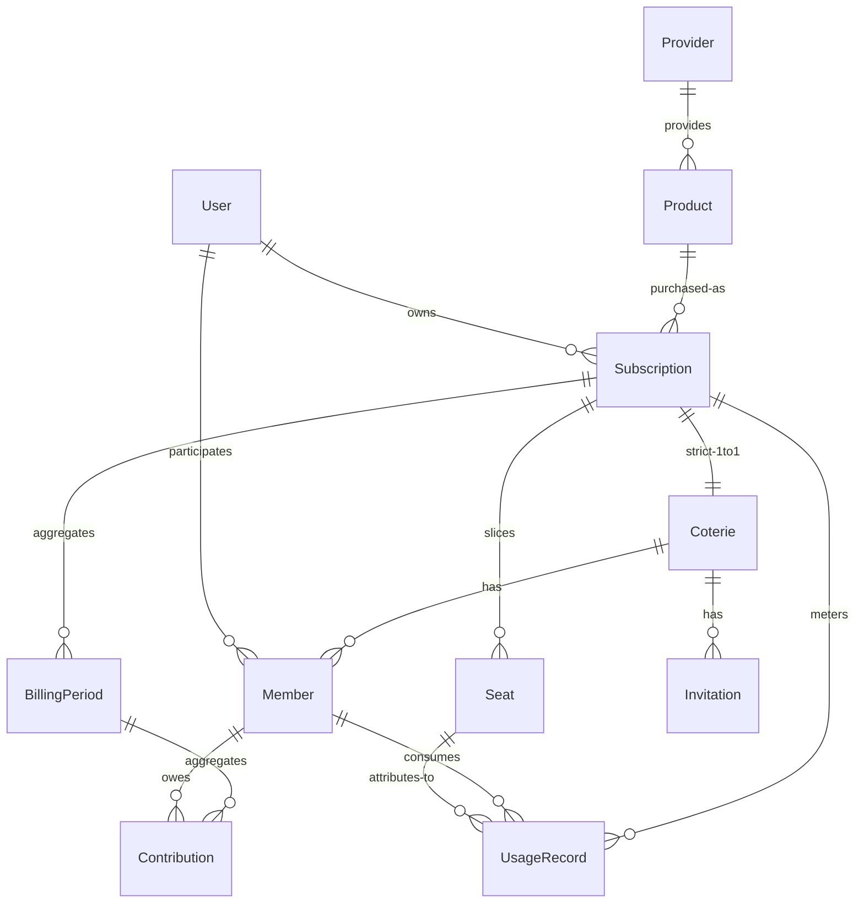

# Coterie 设计计划

| | |
|---|---|
| 状态 | 草稿（Draft） |
| 文档版本 | v0.1 |
| 相关文档 | [总体计划](./project-plan.md) · [需求文档](./requirements.md) |

本文是重构与实现的依据：领域模型、共享模型、计费/支付、技术架构、模块划分、API 与部署。

---

## 1. 领域模型

总览（精确基数见 [§1.2](#12-实体关系er)）：

```text
Provider
    │
    ▼
Product
    │
    ▼
Subscription ── Seats（容量切分）
    │                ▲
    │ 严格 1:1        │ 分配：谁坐哪个坑
    ▼                │
  Coterie ── Member ─┘
      │
      ├── Invitation
      └── BillingPeriod ── Contribution
```

模型与设计原则的对应关系：

| 概念 | 对应原则 |
|------|----------|
| Provider / Product / Subscription 分离 | Principle 1（Generic First）、Principle 2（Subscription ≠ Account） |
| Coterie 为核心 | Principle 4 |
| Member 是平台用户，不是第三方账号 | Principle 3（Member ≠ Account） |
| Subscription 不含密码 | Principle 8（Secret Is Optional） |

### 1.1 概念定义

每个概念用「是什么 / 不是什么」双向定义，划清身份边界。字段级需求见 [需求文档 FR-1 ～ FR-9](./requirements.md#4-功能需求)，本节只回答「这个概念是什么、边界在哪里」。

| 概念 | 是什么 | 不是什么 | 关键字段 |
|------|--------|----------|----------|
| **User** | 平台身份：登录与全局唯一的人 | 不是第三方账号，不保存任何 Provider 凭证 | id, username, email, locale, timezone, status |
| **Provider** | 数字服务提供商的**目录条目**（metadata），描述「谁提供服务」 | 不是订阅，不含套餐与价格 | id, name, category |
| **Product** | Provider 的**可购买套餐**（plan/SKU），描述「买什么」 | 不是已购买的实例；实际支付价格属于 Subscription | provider_id, name, tier |
| **Subscription** | 一次**实际购买**的订阅实例，是**成本与容量的唯一源头**：唯一 Owner、计费周期、实际价格、Sharing Policy、Seat 容量 | 不是账号（不含凭证），不是共享圈（社交结构与之分离） | product_id, owner_user_id, billing_cycle, price, currency, renewal_date, status, max_seats |
| **Coterie** | 围绕**恰好一个 Subscription** 组织的**共享圈**（协作结构）：成员、角色、邀请、分摊都在圈内发生 | 不持有容量（容量来自订阅），不持有凭证 | subscription_id（全局唯一）, name, status |
| **Member** | User 在某个 Coterie 中的**参与记录**（角色 + 状态 + 加入/离开时间） | 不是 Seat（席位是资源，成员是人），不是第三方账号 | coterie_id, user_id, role, status, joined_at, left_at |
| **Seat** | Subscription 容量的**切分单元**，同时是**通用分配单元**（Quota 模式复用，见 D4） | 不是成员（可空闲），不是账号凭证 | subscription_id, label, status, metadata |
| **BillingPeriod** | Subscription 的一个**计费区间**，Contribution 的归集单位 | — | subscription_id, start_date, end_date, status |
| **Contribution** | 成员在某个计费周期内的**费用分摊记录** | 不是支付流水（支付是 Adapter，见 [§4.2](#42-payment-架构)） | billing_period_id, member_id, amount, currency, status |
| **UsageRecord** | 一条**用量记录**（追加式账本）：订阅内某成员的一次计量消费，可归集到其占用的一个席位 | 不是支付流水，不是配额本身（配额是 Seat metadata，见 D4）；记录只增不改，修正记负数 | subscription_id, member_id, seat_id, amount, unit, recorded_at |
| **SharingPolicy** | 挂在 Subscription 上的**共享规则**（模式 + 限制），数据驱动而非代码分支 | 不是业务逻辑里的 if-provider | mode, limits（JSONB） |
| **Invitation** | 进入 Coterie 的**凭证**（token、过期时间、角色） | 不是成员记录，接受后才创建 Member | coterie_id, token, role, expire_at |

身份边界三原则（对应设计原则 #2 / #3 / #8）：

- **Subscription ≠ Account**：订阅之下才有 Seats / Quota / Access，凭证永不入核心模型；
- **Member ≠ Account**：Member 是平台身份在圈内的投影，与任何第三方账号无关；
- **Seat ≠ 账号**：Seat 是分配单元，可以空闲、转移、回收。

### 1.2 实体关系（ER）



基数一览（**加粗为关键决策**）：

| 关系 | 基数 | 说明 |
|------|------|------|
| Provider → Product | 1 : N | 一个提供商多个套餐 |
| Product → Subscription | 1 : N | 同一套餐可被多次购买 |
| User → Subscription | 1 : N | 作为 Owner |
| **Subscription → Coterie** | **1 : 1（严格）** | `coteries.subscription_id` 全局 UNIQUE（D1） |
| **Subscription → Seat** | **1 : N** | 容量切分，席位归订阅所有（D2） |
| Subscription → BillingPeriod | 1 : N | 按周期归集费用 |
| Coterie → Member | 1 : N | 参与记录 |
| User → Coterie | N : M | 经由 Member |
| **Member → Seat** | **0..1 : 0..N** | 一名成员可占多席；任一时刻每个 Seat 至多一名占用者，可空闲。MVP 用 `seats.member_id` 可空外键表达，历史靠 Audit Log |
| BillingPeriod → Contribution | 1 : N | |
| Member → Contribution | 1 : N | |
| Subscription → UsageRecord | 1 : N | 用量账本（Phase 2 Usage Tracking），成员归因、可选席位归集（D9） |

### 1.3 聚合边界与所有权

两个聚合根 + 一组目录实体：

```text
Catalog（目录，弱事务）
└── Provider ── Product

Subscription 聚合根（容量与费用的源头）
├── Seat[]
├── SharingPolicy
├── UsageRecord[]
└── BillingPeriod[]

Coterie 聚合根（协作结构）
├── Member[]
├── Invitation[]
├── Contribution[]（引用 billing_period_id）
└── 引用 Subscription（仅 ID）
```

规则：

- **事务边界即聚合边界**：改 Seat / SharingPolicy / BillingPeriod = Subscription 聚合事务；改 Member / Invitation / Contribution = Coterie 聚合事务；
- **跨聚合只存 ID**：`coteries.subscription_id`、`contributions.billing_period_id`，不持久化对方对象；
- **跨聚合联动走领域事件**：如 `billing_period.closed` → 通知、`member.joined` → 重算 full 标志，对应 `pkg/events`。

### 1.4 关键不变量

1. **严格 1:1**：`coteries.subscription_id` 全局唯一，一个订阅整个生命周期至多一个圈（D1）；
2. **Owner 同一性**：Coterie 创建者必须是 Subscription.owner（D5）；MVP 不允许分离，转让留 Phase 2（转让时订阅与圈一起易主）；
3. **容量**：活跃 Seat 数 ≤ `subscription.max_seats`；Coterie **不单独存 capacity**，创建 API 的 `capacity` 参数语义是「为该订阅创建 N 个 Seat」（D1 + D2 的推论）；
4. **分配合法**：Seat 的占用者必须是「同一订阅所属圈」的活跃 Member；
5. **币种一致**：`contributions.currency` 必须等于 `subscriptions.currency`（MVP 单币种、无换汇，D6）;
6. **周期闭合**：Contribution 必须挂在存在且属于同一 Subscription 的 BillingPeriod 上。

### 1.5 Coterie 生命周期与状态机

持久化状态 5 个，`Full` 为派生标志（D3）：

```text
Draft ──▶ Open ──▶ Active ⇄ Paused
   │        │        │
   └────────┴────────┴────▶ Closed（终态）
```

| 状态 | 语义 | 进入条件 |
|------|------|----------|
| **Draft** | 创建未发布 | 创建 Coterie（必须已绑定 Subscription） |
| **Open** | 招募中，可邀请/加入 | Owner 发布 |
| **Active** | 正式运行，计费生效 | Owner 启动（订阅生效 / 首期开始） |
| **Paused** | 暂停：保留成员与席位，暂停结算 | Owner 暂停；可恢复到 Active |
| **Closed** | 结束共享 | Owner 关闭 / 订阅终止；终态 |

派生标志：`full = (空闲 Seat 数 == 0)`。

- 在 **Open** 状态下 full 为真时拒绝新成员加入；
- 在所有状态下作为展示信息（如「4/5 已满」）；
- 席位释放后自动解除，**不涉及状态迁移**。

行为语义（谁能做什么）见 [需求文档 FR-5](./requirements.md#fr-5-coterie)。

### 1.6 Seat：通用分配单元

Seat 统一承载两类分配，`sharing.mode` 决定其语义：

| 模式 | Seat 语义 | metadata 示例 |
|------|-----------|---------------|
| Seat / Family / Account | 一个可用的独立位置 | `{"label": "Slot 1"}` |
| Quota（D4） | 一份额度 | `{"quota": 300, "unit": "credits", "used": 0}` |

- 状态机：`free / occupied / disabled`；
- 分配：Seat ↔ Member（0..1 占用者），支持空闲、转移、回收（FR-8）；
- Quota 调整 = 更新 metadata，不新增实体；
- 使用量（`used`）的写入由 **Usage Record** 驱动（Phase 2 Usage Tracking）：账本记录落到席位归集后，`used` 重算为该席位归集记录的 SUM（投影，见 D9）；配额本身不被账本行修改。

### 1.7 各实体设计要点

字段清单见需求文档对应条目，此处只记录实现要点：

- **Provider / Product（目录）**：Product 不存价格，实际支付价在 Subscription；目录既可由用户经 Generic Provider 自建（[§5.3](#53-generic-provider)），也可来自 Provider Registry（[§5.4](#54-provider-registry未来)）。
- **Subscription**：聚合根，拥有 Seats / SharingPolicy / BillingPeriods；其 `status` 独立于 Coterie.status——订阅过期而圈尚存时，通过通知驱动圈的 Closed 流程，而不是级联硬删。
- **Coterie**：不存 capacity（不变量 3）、不存任何凭证（NFR-1）；成员与角色语义见 FR-7。
- **Member**：`UNIQUE(coterie_id, user_id)` 保证同一用户在同一圈最多一条活跃记录；离开用 `left_at` 软记录，历史保留供结算追溯。
- **Contribution**：由 Billing 任务按周期批量生成；Manual Settlement 下结算状态由 Owner 手动标记（见 [§4.2](#42-payment-架构)）。

### 1.8 设计决策记录（ADR）

| # | 决策 | 结论 | 理由与影响 |
|---|------|------|------------|
| **D1** | Subscription ↔ Coterie 基数 | **严格 1:1**（UNIQUE 外键） | 席位、费用、结算在单圈内闭环，模型最简；未来需要 1:N 时经迁移扩展 |
| **D2** | Seat 归属 | **Subscription** | 订阅是容量唯一源头——「订阅定坑位，圈内定人选」；Coterie 不存容量字段 |
| **D3** | Full 状态 | **派生标志** | 消除原文状态机中 Full 先于 Active 的歧义；持久化状态收敛为 5 个 |
| **D4** | Quota 建模 | **复用 Seat + metadata** | Seat 成为通用分配单元，概念数量最少；配额调整即 metadata 更新 |
| **D5** | Owner 同一性 | 圈 Owner ≡ 订阅 Owner（MVP） | 1:1 下费用责任人与圈管理人天然一致；转让是 Phase 2 特性 |
| **D6** | 币种 | MVP 单币种、无换汇 | Contribution 币种恒等于订阅币种；FX 留待真实支付阶段（Phase 2+） |
| **D7** | 数据访问层 | **GORM 做 CRUD；AutoMigrate 禁用** | schema 唯一来源仍是手写迁移（`migrations/`），DB 级不变量靠迁移约束保证（[§1.4](#14-关键不变量)）；GORM 只做查询/写入映射，schema 演进由 golang-migrate 在启动时执行 |
| **D8** | 平台认证 | **Email + 密码（bcrypt）+ 不透明 Bearer 会话令牌** | 密码仅存 bcrypt 哈希（可空，为 OAuth/Passkey 留位）；会话令牌 32B 随机数、DB 只存 SHA-256 哈希，泄露数据库也无法冒用（[§6.1](#61-安全模型)）；OAuth / Passkey / OIDC 作为认证模块的扩展点接入，不写死在核心 |
| **D9** | Usage 记账 | **追加式账本 + 投影** | `usage_records` 只增不改（修正记负数记录），是用量唯一事实源；quota Seat 的 `metadata.used` 是其席位归集记录的 SUM 投影，写入时行锁重算，不做增量累加（无浮点漂移、可对账）；账期 `usage` 分摊按成员期内用量比例、最大余数法分币，总额精确守恒（[§4.1](#41-billing)） |

---

## 2. 共享模型

这是项目未来最重要的扩展点之一。不同服务的共享方式不同，Coterie 必须支持多种模式。

### 2.1 Account Sharing

多个用户共享一个账号。

```text
Netflix Account
      │
 ┌────┼────┐
 ▼    ▼    ▼
User User User
```

### 2.2 Seat Sharing

每个人拥有独立席位。

```text
Software Subscription
        │
 ├── Seat 1 → Alice
 ├── Seat 2 → Bob
 └── Seat 3 → Charlie
```

适合：软件、SaaS、AI、团队服务。

### 2.3 Family Sharing

服务本身提供家庭组。

```text
Family Plan
    │
 ├── Owner
 ├── Member
 ├── Member
 └── Member
```

### 2.4 Quota Sharing

不是共享账号，而是共享额度。

```text
1000 credits
      │
 ├── Alice → 300
 ├── Bob   → 300
 └── Carol → 400
```

适合：AI、API、Cloud、存储、VPN 流量。

### 2.5 Resource Sharing

共享某种资源。

```text
Cloud Storage
     │
     ├── 1 TB
     │
     ├── Alice
     ├── Bob
     └── Charlie
```

### 2.6 结论

Coterie 的核心不是：

> Account Sharing

而是：

> **Resource / Subscription Sharing**

因此 Seat、Quota 等都统一抽象为「订阅下的可分配单元」——Seat 是通用分配单元（见 [§1.6](#16-seat通用分配单元)），分配规则由 Sharing Policy 描述（见 [§3](#3-sharing-policy)）。

---

## 3. Sharing Policy

不同服务具有不同共享规则，抽象为 `SharingPolicy`。

```yaml
sharing:
  mode: seat
  max_members: 5
  max_devices: 10
  region: US
  transfer: true
```

```yaml
sharing:
  mode: quota
  quota: 1000
  unit: credits
```

未来扩展的限制类型：

```text
DeviceLimit
RegionLimit
ConcurrentLimit
MemberLimit
QuotaLimit
UsageLimit
TimeLimit
```

设计要点：

- `mode` 决定 Seat 的语义（account / seat / family / quota / resource），映射见 [§1.6](#16-seat通用分配单元)；
- Sharing Policy 挂在 Subscription 上，Coterie 继承并可在更严格范围内收敛；
- Policy 是合规信息的载体之一，配合 UI 提示（见 [需求文档 NFR-2](./requirements.md#nfr-2-合规与风险)）；
- Provider-specific 字段不要建强结构列，用 JSONB 承载 metadata。

---

## 4. 计费与支付

### 4.1 Billing

```text
Subscription
      │
      ▼
Billing Period
      │
      ▼
Member Contribution
      │
      ▼
Settlement
```

支持：

- 月付 / 年付 / 自定义周期
- 按席位 / 按比例 / 固定金额 / 按使用量

Phase 1 落地状态（Manual Settlement，已实现）：

- `POST /api/v1/subscriptions/{id}/billing-periods` 以显式起止日期开账期——月付、年付、自定义周期都是显式区间；同订阅同 `start_date` 唯一（409）；
- `POST /api/v1/billing-periods/{id}/contributions/generate` 一次性生成分摊，`mode` 取：
  - `equal`（默认）均摊订阅价格，整除余数按「先加入多一分」分币，总额精确守恒；
  - `per_seat` 按占用席位分摊，无席位成员不产生分摊记录；
  - `fixed` 由 Owner 显式指定成员金额（成员必须活跃且不重复）；
  - `usage` 按成员在账期窗口 `[start_date, end_date)` 内的用量记录比例分摊：
    - 窗口内所有记录必须同一 `unit`（混合单位 422）；活跃成员用量合计 ≤ 0（无记录或净负）422；单个成员净用量为负 422（先补负数修正记录对平）；
    - 席位分币用**最大余数法**（余数并列时先加入者优先），分摊总额精确等于订阅价格；用量为零的成员不产生分摊记录；
    - 已离开成员的用量不计入分摊基数（与其它 mode 只对活跃成员分摊一致）；
- 币种恒等于订阅币种（不变量 5）；每成员每账期至多一条 Contribution（不变量 6）；已生成的账期不可重复生成（409）；
- `POST /api/v1/billing-periods/{id}/close` 单向关闭账期：关闭后禁止再生成与修改金额，但结算状态仍可更新（允许补记）；
- `PATCH /api/v1/contributions/{id}` 由 Owner 标记 `paid / waived / pending / cancelled`（手动结算）；进入 `paid` 记 `paid_at`，离开即清除。

用量记账（Phase 2 Usage Tracking，Phase 2 起）：

- `POST /api/v1/subscriptions/{id}/usage-records` 由 Owner 记账：`member_id` 必须是订阅圈内活跃成员（不变量 4），`amount` 为十进制字符串、最多 4 位小数、允许负数（修正），`unit` 必填（自由文本，如 `credits` / `GB`），`recorded_at` 缺省为当前时刻；
- 席位归集：显式给 `seat_id`（必须是该成员占用的本订阅席位）；不给时若成员恰好占用**一个**含 `quota` 的席位则自动归集到它，占多个时 422 要求显式指定；
- 投影（D9）：归集席位 metadata 含 `quota` 时，事务内行锁重算 `used` = 该席位全部归集记录之 SUM；无 `quota` 的席位只记账不投影；
- 账本只追加：无 PATCH/DELETE，修正一律记负数记录；
- `GET /api/v1/subscriptions/{id}/usage-records?member_id=&unit=&from=&to=` 按成员/单位/日期窗口过滤（`from`/`to` 为 `YYYY-MM-DD`，含 to 当日）；`GET /api/v1/usage-records/{id}` 单条查询；读操作对所有已认证用户开放。

### 4.2 Payment 架构

支付是 **Adapter**，不是核心业务模型（Principle 7）。

```text
Payment
   │
   ├── Manual
   ├── Stripe
   ├── PayPal
   ├── Alipay
   ├── WeChat Pay
   └── Other
```

**第一阶段只支持 Manual Settlement**：

> 系统负责记录谁应该支付多少钱。

这样避免第一版就把项目变成支付系统。后续再增加真实支付 Adapter。

设计要点：

- Contribution 的 `status` 表示分摊记录的结算状态，与具体支付渠道解耦；
- Payment Adapter 只负责把「应收」标记为「已收」，不反向驱动领域模型。

---

## 5. Provider Adapter

### 5.1 原则

不要在核心业务里写：

```text
if netflix
if disney
if spotify
if chatgpt
```

而应该提供 Provider Adapter：

```text
Provider
   │
   └── Adapter
        ├── Metadata
        ├── Validation
        ├── Subscription
        ├── Sharing
        └── Usage
```

**Provider Adapter 必须是可选扩展，核心平台不应依赖任何特定 Provider。**

### 5.2 目录结构

```text
providers/
├── generic/
├── netflix/
├── spotify/
└── ...
```

### 5.3 Generic Provider

第一版本最重要的 Provider 是 **Generic Provider**：允许用户手动创建任意服务。

```text
Provider:
    My Software

Product:
    Premium Plan

Subscription:
    5 Seats

Coterie:
    Development Team

Members:
    5
```

即使没有 Provider Adapter，系统也必须可以完整工作。

### 5.4 Provider Registry（未来）

```text
Provider Registry

Streaming
├── Netflix
├── Disney+
├── Hulu
└── ...

Music
├── Spotify
├── YouTube Music
└── ...

AI
├── ChatGPT
├── Claude
└── ...

Software
├── Adobe
├── JetBrains
└── ...
```

Registry 只是 **Metadata Catalog**，不要让它和具体账号绑定。

---

## 6. 安全与 Secret

### 6.1 安全模型

不要把账号密码作为核心模型。系统尽量存 Credential Metadata：

```text
Access Method:
    External

Credential:
    Not stored
```

#### 平台身份认证（ADR D8）

Provider 侧凭据按上文只存 Metadata；平台自身账号（用于管理目录与订阅）采用最简可行认证：

| 项 | 设计 |
|---|---|
| 注册 | `POST /api/v1/auth/register`，Email + 密码；密码经 **bcrypt**（DefaultCost）哈希后入库，`users.password_hash` 可空（为未来 OAuth / Passkey 用户留位） |
| 登录 | `POST /api/v1/auth/login`，按 email 查用户后 bcrypt 比对；失败统一返回 `401 "invalid email or password"`，不区分「邮箱不存在」与「密码错误」（防枚举） |
| 会话令牌 | 32 字节 `crypto/rand` 随机数 → base64url 不透明字符串，经 `Authorization: Bearer <token>` 传递 |
| 服务端存储 | `sessions` 表只存 **SHA-256(token)** 与 `expires_at`；令牌本身不落库，数据库泄露也无法直接冒用 |
| TTL | 30 天；过期或不存在 → `401 {"error":{"code":"unauthorized",...}}` |
| 公开端点 | 仅 `GET /healthz`、`POST /api/v1/auth/register`、`POST /api/v1/auth/login`；其余全部端点套 RequireUser 中间件 |

### 6.2 Secret Management

如果未来需要保存 Account / Password / Recovery Code / API Key / License Key，进入独立 Secret 模块：

```text
Coterie
   │
   ▼
Secret Reference
   │
   ▼
Secret Store
```

数据库只保存 `secret_id`，不存明文 Secret。

---

## 7. 技术架构

### 7.1 总体架构

```text
                Web
                 │
                 ▼
              API
                 │
        ┌────────┼────────┐
        ▼        ▼        ▼
     Identity  Coterie  Billing
        │        │        │
        └────────┼────────┘
                 │
             Repository
                 │
        ┌────────┼────────┐
        ▼        ▼        ▼
     PostgreSQL Redis  Object Storage
```

### 7.2 Backend：Go

原因：

- API 服务非常适合
- 部署简单，Docker 友好
- 并发模型简单
- 开源项目容易运行
- 单 Binary 方便 self-hosting

### 7.3 Database：PostgreSQL

作为主数据库。原因：

- 关系模型非常适合
- Billing / Membership / Subscription 都属于强关系数据
- JSONB 可以承载 Provider-specific metadata
- 事务能力好

### 7.4 Cache：第一阶段不依赖 Redis

只有真正需要 Session / Rate Limit / Queue / Cache / Distributed Lock 时再增加 Redis。

第一阶段目标形态：

```text
Single Binary
     +
PostgreSQL
```

即可运行。

### 7.5 Frontend

推荐：**React + TypeScript**

配合：

- Vite
- Tailwind CSS
- shadcn/ui
- TanStack Query
- TanStack Router

目标：**Dashboard-first**。不要第一版就做复杂 Marketplace。

### 7.6 客户端形态

第一阶段：**Web Responsive** 即可。

```text
Web
 │
 ├── Desktop PWA
 ├── Mobile PWA
 ├── Desktop App
 └── Mobile App
```

不要一开始维护三套客户端。

---

## 8. 模块划分

建议代码结构：

```text
coterie/
├── apps/
│   ├── server/          # main + 优雅停机
│   └── web/
│
├── internal/
│   ├── config/          # 环境变量解析
│   ├── database/        # GORM 打开/连接池 + golang-migrate + Date/JSONB 类型
│   ├── testsupport/     # testcontainers 测试基建（PG18 + 迁移）
│   ├── app/             # 路由装配（healthz + 各模块），main 之外可测试
│   ├── identity/
│   ├── auth/            # ✅ M2a：注册/登录/会话 + RequireUser 中间件
│   ├── user/            # ✅ M1：model/store/service/http + 集成测试
│   ├── provider/        # ✅ M1：同上
│   ├── product/         # ✅ M1：同上
│   ├── subscription/    # ✅ M1：同上
│   ├── seat/            # ✅ M2b：席位（容量管理、分配/释放/转移）
│   ├── coterie/         # ✅ M2b：圈聚合（含 member 与 invitation，事务同聚合）
│   ├── billing/         # ✅ FR-9：账期 + 分摊（equal/per_seat/fixed）+ 手动结算
│   ├── notification/    # ✅ FR-12：站内信（payment_due / seat_assigned / coterie_closed 联动）
│   ├── audit/
│   └── secret/
│
├── pkg/
│   ├── api/             # ✅ M1：错误信封/JSON/中间件/分页
│   ├── events/
│   └── plugin/
│
├── migrations/
├── deployments/
├── docs/
└── assets/
```

模块与领域模型的对应：

| 模块 | 领域概念 |
|------|----------|
| `provider` / `product` | Provider、Product |
| `subscription` | Subscription、Sharing Policy |
| `seat` | Seat（订阅容量与分配） |
| `coterie`（含 member、invitation） | Coterie、Member、Invitation |
| `billing`（含 contribution） | BillingPeriod、Contribution、Settlement |
| `notification` | Notification（Web 站内信；Email/Push/Webhook 为 Phase 2 适配器） |
| `audit` / `secret` | 支撑能力 |
| `auth` / `identity` / `user` | 平台账号与会话（D8）、外部身份（扩展点）、用户 |

具体目录可根据实际代码调整。

---

## 9. API 设计

### 9.1 原则

API-first：从第一天开始设计，Web 界面只是 API 的客户端。

### 9.2 核心资源

```text
/api/v1/auth          (register / login / logout / me)
/api/v1/users
/api/v1/providers
/api/v1/products
/api/v1/subscriptions
/api/v1/coteries
/api/v1/members
/api/v1/seats
/api/v1/billing-periods
/api/v1/contributions
/api/v1/usage-records
/api/v1/invitations
/api/v1/notifications
```

### 9.3 示例

创建 Coterie：

```http
POST /api/v1/coteries
```

```json
{
  "subscription_id": "sub_123",
  "name": "Netflix Family",
  "capacity": 5
}
```

> `capacity` 的语义：为该订阅创建 N 个 Seat（订阅与圈严格 1:1，见 [§1.4](#14-关键不变量) 不变量 3）。

```http
POST /api/v1/coteries/{id}/join
```

查看：

```http
GET /api/v1/coteries/{id}
```

---

## 10. 事件与 Webhook

未来 Provider 或支付系统可以通过 Webhook 更新状态：

```text
Payment
   ↓
Webhook
   ↓
Coterie
   ↓
Billing
```

支持的事件：

```text
subscription.updated
subscription.expired
payment.completed
payment.failed
member.joined
member.left
```

内部同样建议以事件驱动的方式连接模块（如 `member.joined` 触发通知、`payment.completed` 触发 Contribution 状态变更），对应 `pkg/events` 模块。

---

## 11. 部署

### 11.1 目标

```bash
docker compose up -d
```

即可运行。

### 11.2 最小部署

```yaml
services:
  coterie:
    image: ...

  postgres:
    image: postgres
```

### 11.3 未来扩展

```text
redis
worker
minio
```

### 11.4 Self-hosting

支持：Docker、Docker Compose、Kubernetes、Bare Metal；**官方优先 Docker Compose**。

---

## 12. 未来扩展方向

### 12.1 Plugin Architecture

```text
plugins/
├── providers/
├── payment/
├── notification/
├── authentication/
└── storage/
```

核心系统保持稳定，扩展通过插件承载。

### 12.2 Multi-tenancy

```text
Instance
   │
   ├── Organization
   │
   ├── Users
   │
   └── Coteries
```

第一阶段不做：Single Tenant / Self-hosted First。

### 12.3 Marketplace

作为独立模块演进（对应 [需求文档 FR-16](./requirements.md#fr-16-marketplacephase-2)），不与核心共享模型耦合。

---

## 13. 决策记录与遗留问题

核心设计决策已全部收敛到 [§1.8 设计决策记录（ADR）](#18-设计决策记录adr)：D1 严格 1:1、D2 Seat 归 Subscription、D3 Full 为派生标志、D4 Quota 复用 Seat、D5 Owner 同一性、D6 MVP 单币种、D7 GORM CRUD + 手写迁移、D8 平台认证机制。

实现阶段仍需确认的细节：

- 比例分摊的舍入与尾差归属（Owner 承担 / 最大份额者 / 轮转）；
- 自定义计费周期的表达方式（cron 表达式 vs 天数偏移）；
- Seat 分配历史是否需要独立表（MVP 依赖 Audit Log 回溯）。
